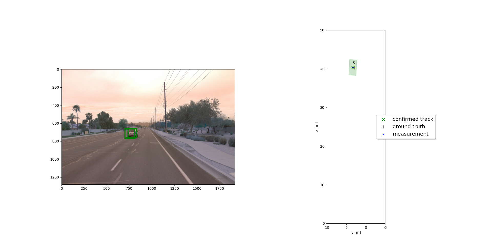
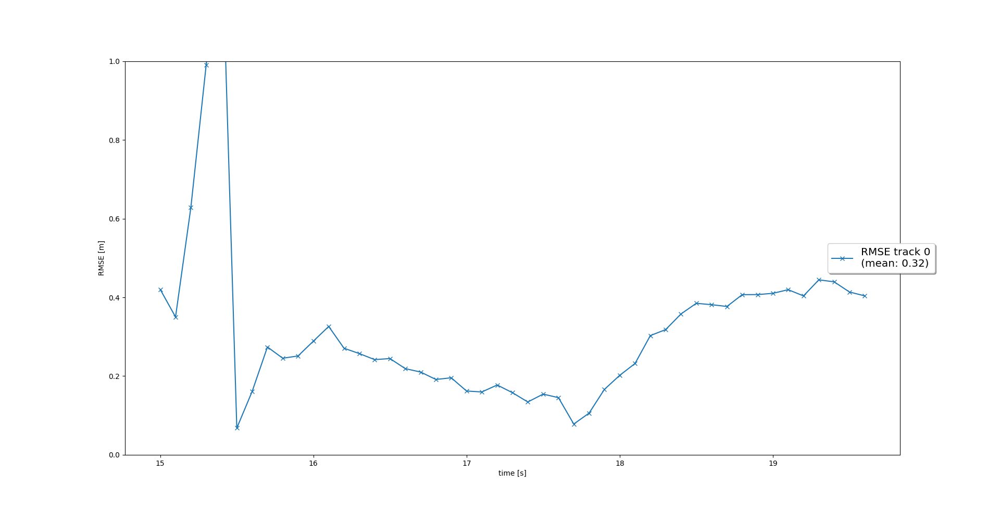
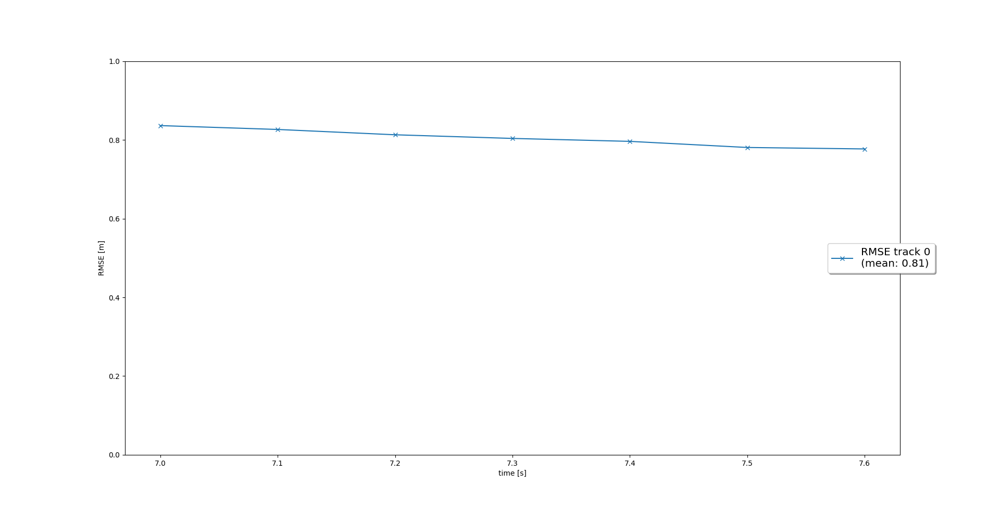
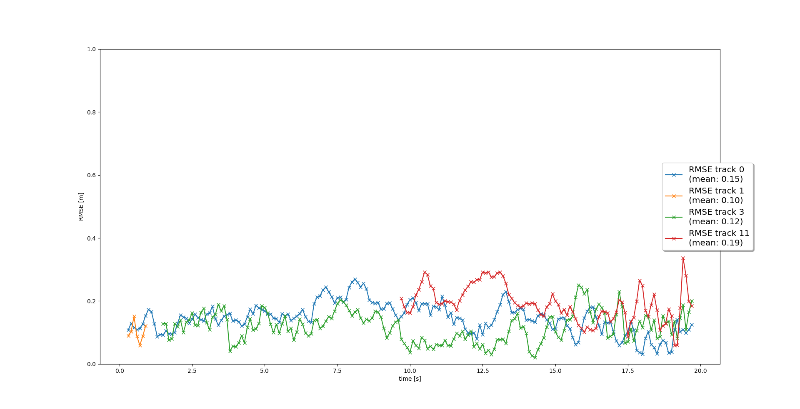
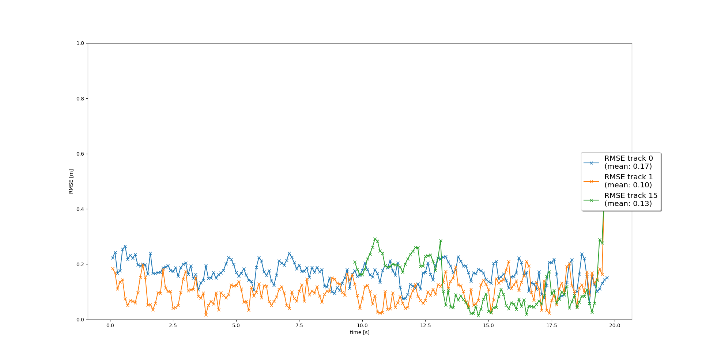

# Writeup: Track 3D-Objects Over Time

Please use this starter template to answer the following questions:

### 1. Write a short recap of the four tracking steps and what you implemented there (filter, track management, association, camera fusion). Which results did you achieve? Which part of the project was most difficult for you to complete, and why?

For the tracking phase, we implemented four different steps. In the order, they are: EKF, track management, data association, camera-lidar sensor fusion.

### Step 1
The goal for the first step was to implement an EKF to track a single object with lidar measurements. This code has been implemented in student/filter.py.

The result is shown in the following img:

We can see how the filter is able to track the object correctly. The overal RMSE is under 0.35 with just a single higher peak at the beginning of the tracking phase due to probably the higher initial uncertainty on the velocity of the obj.

### Step 2
In the second step, we had to implement the track management module to initialize and delete tracks, and set track state and score.
The Trackmanagement classe has 2 main functions:
1. manage_tracks() -> decrease track score for unassigned tracks and delete tracks if the score is too low or P is too big
2. handle_updated_track() -> increase the track score and change the track state from 'initiated' to 'tentative' or 'confirmed'.
Now the tracks will show a changing color depending on their state and they are deleted when they are no more in the fov of the sensor for a couple of frames.
The RMSE in this case is high (around 0.8) because the lidar detections contain a y-offset, which cannot be compensated by the KF because we assume a zero-mean data.

### Step 3
In the third step, we had to implement the SNN (Single Nearest Neighbor) data association algorithm to associate measurements to tracks. Now we have multiple objects and the tracks have to be assigned correctly to the corresponding object. We observed also the creation of some ghost tracks for a couple of frames due to False Positives from the object detection network. However, they will be deleted almost immediately, and in this case, they never appear in front of the car, so they should not cause erraneous behavior (for example, emergency braking).
The RMSE is now showing multiple tracks. We can see that some of them are created and deleted quickly.

### Step 4
Finally, in the fourth step, we implemented sensor fusion by adding the nonlinear camera measurement model. 
Thanks to the integration of the camera data, we observed the disappearance of the ghost tracks. Probably, this is due to the fact that the FP are not detected by the camera and so they are erased when the camera data is fed to the EKF.

### Considerations: 
Thanks to the lectures and the various exercises, implementing these 4 steps was quick and straightforward! It's amazing to see how these apparently complex tasks can be divided into well defined steps.

### 2. Do you see any benefits in camera-lidar fusion compared to lidar-only tracking (in theory and in your concrete results)? 
Observing the tracking performed with just the lidar and then with both sensors, I can infer one benefit: the elimination of ghost tracks. Indeed, the RMSE for the two tasks are comparable, so there is not a direct improvement on the quantitative results. However, looking at the videos, the sensor fusion one doesn't show initialized ghost tracks. The lidar present False Positives that the camera does not detect. Therefore, thanks to the sensor fusion, these FP are erased immediately once the camera data is fed to the algorithm.

### 3. Which challenges will a sensor fusion system face in real-life scenarios? Did you see any of these challenges in the project?
The main challenge is the detection of all the vehicles in the scene. Looking at the final video, it is clear that the system should detect not only the two front cars, but also the other cars present in the scene. This is because a risky scenario can arise not only from the nearest cars, but from any object in the scene. For example, if the car in front of the detected one brakes abruptly, the car should start a safe maneuver without relying on the actions of the car in front.

### 4. Can you think of ways to improve your tracking results in the future?
Improvements of the tracking can come from the introduction of other sensors or the refinement of the performances of the old ones. Also, the introduction of a nonlinear model for the motion of the objects can reduce the overall error since the KF will give better predictions.

